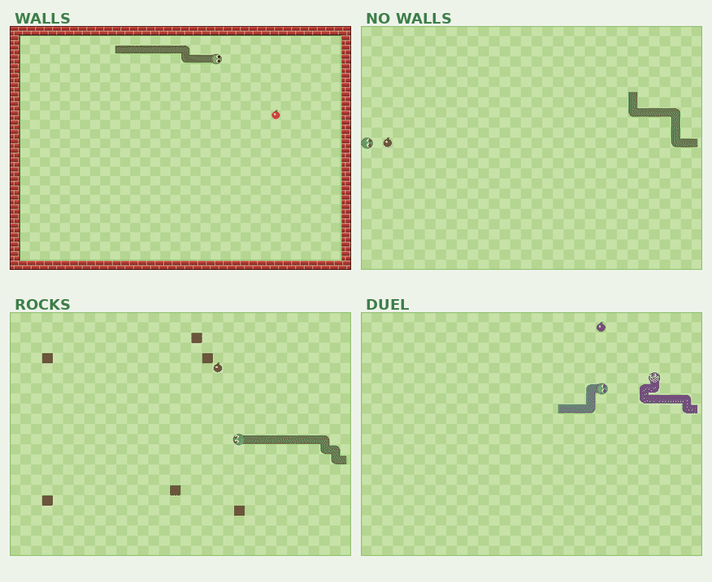
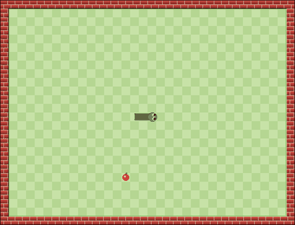
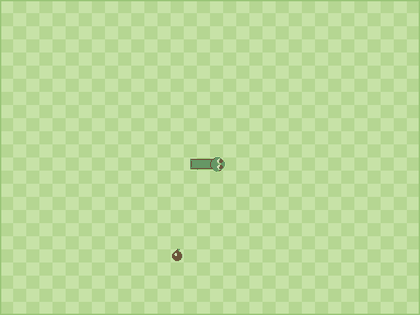
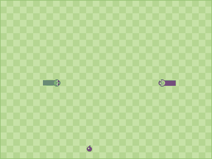

<div align="center">


# Snake-RL · Bondo2

**A Dueling Double-DQN agent named Bondo2 (بندق — *hazelnut* in Arabic) that learns to play Snake, trained headlessly and served through a FastAPI + WebSocket web app with a smooth HTML5-canvas renderer.**

Four game modes. Live training view. Pre-trained playback. Human-vs-AI duel.

[](https://www.python.org)
[](https://pytorch.org)
[](https://fastapi.tiangolo.com)
[](https://arxiv.org/abs/1511.06581)
[](https://developer.mozilla.org/en-US/docs/Web/API/Canvas_API)
[](#credits)



</div>

---

## What's in the box

<table>
<tr>
<td>

- **Four game modes** — walls · no-walls · rocks · duel
- **Enhanced learner** — Dueling Q-network + Double DQN + target net + replay buffer + gradient clipping
- **Vectorized trainer** — 64 parallel envs per process, all 4 modes share one GPU
- **Web UI** — single-page app with live WebSocket stream, smooth interpolated rendering, keyboard-controlled human play
- **Headless by default** — server runs on CPU; training is a separate CLI

</td>
<td>


</td>
</tr>
</table>

---

## Before vs After training

Left column: **untrained** randomly-initialised policy (a couple of seconds before it walks into a wall / the rocks / itself).
Right column: **trained** agent playing greedily from the checkpointed weights.

<table>
<tr>
  <th></th>
  <th>Before training</th>
  <th>After training</th>
</tr>
<tr>
  <td><strong>Walls</strong><br><sub>boundary = death</sub></td>
  <td></td>
  <td></td>
</tr>
<tr>
  <td><strong>No walls</strong><br><sub>the board wraps at the edges</sub></td>
  <td></td>
  <td></td>
</tr>
<tr>
  <td><strong>Rocks</strong><br><sub>red brick hazards spawn every 25 frames</sub></td>
  <td></td>
  <td></td>
</tr>
<tr>
  <td><strong>Duel</strong><br><sub>two snakes share a wrapping board</sub></td>
  <td></td>
  <td></td>
</tr>
</table>

---

## Training results

All four agents trained in parallel on a single GPU, ~34 minutes total. The checkpoint saved for each mode is the *rolling-200-episode-mean best*, not just the final weights — so tail-noise at the end of training never overwrites a good policy.

| Mode      | Episodes | Best single score | **Best rolling-mean** | Throughput   |
|-----------|---------:|------------------:|----------------------:|-------------:|
| walls     | 132 000  | 72                | **27.30**             | 15.5 k env-steps/s |
| no-walls  | 109 000  | **106**           | **36.51**             | 14.5 k       |
| rocks     | 104 000  | 84                | **31.14**             | 11.6 k       |
| duel      | 79 000   | 66                | **25.23**             | 10.9 k       |

> **Learner upgrades over vanilla DQN:**
> &nbsp;• Dueling network (separate value & advantage heads)
> &nbsp;• Double-DQN update (online net selects next action, target net evaluates it)
> &nbsp;• Target-network sync every 500 updates
> &nbsp;• Huber (smooth-L1) loss + gradient clipping
> &nbsp;• Exponential ε-decay with a floor at 0.02
> &nbsp;• 21-dim hand-crafted state with 2-step look-ahead dangers, food-chebyshev distance, mode-specific signals (opponent proximity for duel, rock proximity for rocks)

---

## Repo layout

```
Snake-AI-Trainer/
├── backend/
│   ├── snake_rl/
│   │   ├── game.py          # headless engine, 4 modes
│   │   ├── state.py         # 21-dim state encoder
│   │   ├── model.py         # Dueling Q-network
│   │   ├── agent.py         # Double DQN + target net + replay
│   │   ├── train.py         # single-env training CLI
│   │   └── vec_train.py     # 64-env vectorised training CLI (recommended)
│   ├── models/              # trained .pth weights (one per mode)
│   └── server.py            # FastAPI + WebSocket app
├── frontend/
│   ├── templates/index.html
│   └── static/              # style.css, app.js, img/bondo2.png
├── scripts/
│   └── make_gifs.py         # render the before/after GIFs in this README
├── assets/
│   ├── bondo2.png           # character icon
│   ├── banner.png           # 2×2 hero banner
│   └── gifs/                # README GIFs
├── requirements.txt
├── run.sh
└── README.md
```

---

## Setup

```bash
conda create -n snake-rl python=3.11 -y
conda activate snake-rl
pip install torch numpy fastapi "uvicorn[standard]" Pillow imageio
```

## Train

```bash
# train all four modes in parallel on a free GPU (recommended)
for mode in walls no_walls rocks duel; do
  CUDA_VISIBLE_DEVICES=<idx> python -m backend.snake_rl.vec_train \
    --mode $mode --num-envs 64 --max-seconds 3600 --device cuda &
done
wait

# or a single mode, CPU
python -m backend.snake_rl.vec_train --mode walls --num-envs 64 --max-seconds 900 --device cpu
```

Weights land in `backend/models/<mode>.pth`. The web app picks them up on each WebSocket connect.

## Run the web app

```bash
./run.sh            # uvicorn on 127.0.0.1:8000
# open http://127.0.0.1:8000
```

The landing page has three options:

- **Watch it learn** — pick a mode, see a fresh agent train live in the browser. Speed slider, pause, reset.
- **Watch it play** — pick a mode, watch the trained agent play greedily.
- **Compete** — you control the green snake with **WASD / arrow keys**, the AI controls the purple one.

## Regenerate the README GIFs

```bash
python scripts/make_gifs.py --fps 12
```

---

## Visual design notes

- **Garden-cell grass** with a two-tone checker pattern (lighter / darker green) so the snake reads clearly against it
- **Red-brick wall frame** around the playfield in `walls` mode; same brick language for individual rocks in `rocks` mode
- **Solid-body snake** drawn as a single stroked polyline (wrap-aware), with a rounded head blob and big cute eyes that look in the direction of motion
- **Dead snakes freeze** on the cell they died in with X-eyes — no interpolation, no wander
- **Smooth rendering** via `requestAnimationFrame` with segment-level interpolation independent of server FPS (default 10 fps tick rate, up to 120)

---

## Credits

Character design (Bondo2) generated with Google Gemini Nano Banana.
Fonts: [Outfit](https://fonts.google.com/specimen/Outfit) via Google Fonts.
Icons: inline SVG (Lucide-style strokes), no external assets.

---

*This repository is a full rewrite of an earlier PyGame + tutorial-DQN project.*
